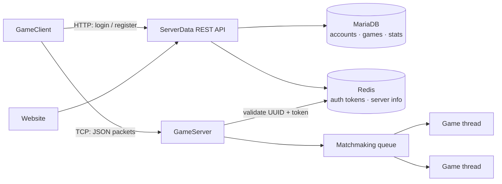

# Networked Console Games

**A multiplayer console game platform in C#: a multithreaded TCP game server with matchmaking, a REST API for accounts and authentication, Redis-backed sessions, a MariaDB database and a companion website, all hosted on a Linux VPS.**

Built as my A-level Computer Science NEA (Barton Peveril College). Instead of using a game-networking library, I built the whole stack myself, from the socket layer upwards.

---

## System overview

The solution has three projects plus a website:

| Component | Role |
|---|---|
| **GameClient** | Console app with an arrow-key menu system. Handles login/registration through the API, then connects to a game server over TCP. |
| **GameServer** | TCP listener that authenticates clients, runs matchmaking queues and hosts games on separate threads. Configured by a JSON file, with an update manager that restarts the server when the executable changes. |
| **ServerData** | REST API (ASP.NET Web API, self-hosted with OWIN) for accounts, auth tokens, stats and server status. Talks to MariaDB and Redis. |
| **Website** | Account profile, stats and player lookup pages. |



## How it works

**Networking.** The server accepts connections with a `TcpListener` and handles each client asynchronously. Messages are `Packet` objects, serialised to JSON (Newtonsoft.Json), converted to bytes and sent over `NetworkStream`s. The server detects and cleans up ungraceful disconnects.

**Authentication.** Logging in through the API generates a 12-character token, which is stored in Redis against the account UUID with a one-hour expiry. When a client connects to a game server, it must present its UUID and token before being matched. This separates real players from plain connection pings. Tokens only live in memory and are cleared on restart.

**Matchmaking and games.** Players queue for a game type. The server fills open games first and creates new ones when none are available. Games implement a common `IGame` interface and each runs on its own thread, so many can run at once. Rock-Paper-Scissors is the implemented game.

**Infrastructure.** Everything is hosted on a Linux VPS: game server under Mono, MariaDB, Redis (password-protected), Apache for the website, and a firewall configured to expose only the required ports.

## Tech stack

C#, .NET, `System.Net.Sockets`, Newtonsoft.Json, ASP.NET Web API + OWIN, StackExchange.Redis, MariaDB, Apache, Mono, Linux VPS

## Repository structure

```
NEA Console Games/   Final solution: GameClient, GameServer and ServerData (REST API) projects
NEA Prototype/       Early TCP client/server prototype used to test the networking approach
Scripts/             Server and deployment scripts   <!-- TODO: confirm what's in here -->
CD/                  <!-- TODO: describe -->
```

## Running it

This was built and hosted on a VPS in 2022, and that environment no longer exists, so the project isn't maintained as a runnable deployment. To run it locally you would need MariaDB and Redis running, with the connection details set in the server and API config. Then start **ServerData**, then **GameServer**, then two or more **GameClient** instances from the solution in Visual Studio.

The NEA write-up documents the full design, database schema and test plan. <!-- TODO: optionally add the write-up PDF (with candidate/centre numbers removed) and link it here -->

## Testing

Tested against a 20+ case test plan covering menus, input validation, account creation, login, matchmaking and gameplay. The full test table is in the NEA write-up.

## Looking back

This was my first large system. If I rebuilt it now, I'd change the following:

- **Password security.** Passwords are stored and sent in plain text, including in API query strings. I'd hash them with bcrypt or Argon2 and send credentials only in POST bodies over HTTPS.
- **SQL injection.** Queries are built by string interpolation. I'd switch to parameterised queries.
- **Token generation.** Tokens use `System.Random`, and the generator only indexes a subset of its character set. I'd use a cryptographically secure generator such as `RandomNumberGenerator`.
- **Transport.** I'd wrap connections in TLS (`SslStream`) instead of sending plain TCP.
- **Tests.** I'd add automated unit tests around packet serialisation and matchmaking.

## Author

**Matthew Pickard** · [LinkedIn](https://www.linkedin.com/in/matthew-pickard-a302173a6) · [GitHub](https://github.com/mattp2004)
